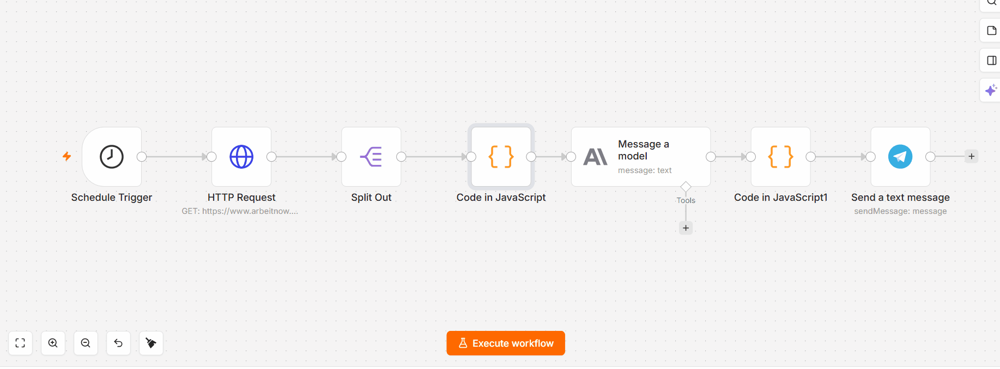

# Job Fit & Gap Analyzer

An automated n8n workflow that screens incoming job postings daily, scores fit against a candidate profile using Claude (Anthropic API), and sends structured Telegram notifications — turning manual job-search triage into a transparent, automated pipeline.

Built to demonstrate practical AI-product development: not just "interest in AI," but a working, deployed automation combining a public API, an LLM reasoning step, and a real-time notification channel.

## What it does

1. **Fetches** fresh job postings daily from the [Arbeitnow](https://www.arbeitnow.com) public job board API (no auth required)
2. **Filters** postings by title keyword and location (Berlin)
3. **Scores** each match against a candidate profile using Claude — fit score (1–10), matched skills, gap skills, and a recommendation (`apply` / `apply_with_note` / `skip`)
4. **Notifies** via Telegram with a formatted summary and a direct link to the posting

## Architecture
Schedule Trigger (daily, 9:00)
→ HTTP Request (Arbeitnow public API)
→ Split Out (unwraps the response array into individual items)
→ Code node — keyword + location filter
→ Anthropic node — Message a model (claude-haiku-4-5)
→ Code node — parse LLM JSON response, re-attach original job fields
→ Telegram node — send formatted message

## Example output

> 📊 **Investment Analyst (m/w/d) im Bereich Kapitalmärkte**
> 🏢 DeltaValue GmbH
>
> Fit Score: 5/10
> Recommendation: apply_with_note
>
> Strong analytical and technical foundation, but lacks finance domain expertise and investment-specific knowledge; requires significant ramp-up on capital markets, trading, and portfolio concepts.
>
> ✅ Matched: Data analysis (Python/pandas), Time series analysis, Dashboard creation (Power BI/Tableau), SQL, Statistical foundations
> ❌ Gaps: Investment analysis and valuation methods, Capital markets regulatory knowledge, Portfolio management

## LLM prompt

You are helping evaluate a job posting for a data analyst candidate.
Candidate profile:

Experience: 1.5 years as Market Data Analyst (import/export data, trend dashboards), M.Sc. in Materials Science
Stack: Python (pandas), SQL (joins, window functions, CTE), Power BI, Tableau, Plotly/Dash
Statistics: hypothesis testing, time series (ARIMA/SARIMA/Prophet)
Known gaps: dbt, Databricks, cloud DWH (Snowflake/BigQuery), Airflow

Job posting:
Title: {{ $json.title }}
Company: {{ $json.company_name }}
Description: {{ $json.description }}
Return ONLY JSON, no explanation:
{
"fit_score": 1-10,
"matched_skills": ["..."],
"gap_skills": ["..."],
"recommendation": "apply / apply_with_note / skip",
"one_line_reason": "..."
}

## Stack

- **n8n** — workflow orchestration
- **Anthropic API** (Claude Haiku) — job fit scoring and gap analysis
- **Arbeitnow API** — public job board data source
- **Telegram Bot API** — notification delivery

## Files

- [`workflow.json`](./workflow.json) — exported n8n workflow, importable directly into any n8n instance

## Notes

This is a lightweight proof of concept built in a single afternoon, deliberately scoped to be realistic rather than exhaustive: one data source, one keyword filter, one LLM call per posting. The goal was to demonstrate an end-to-end working AI automation, not a production-grade job aggregator.
